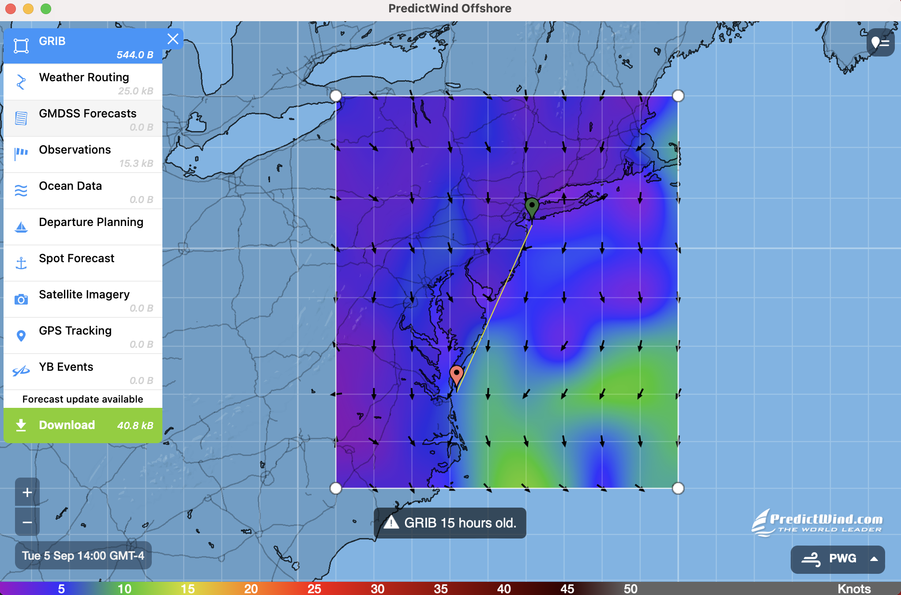

# PredictWind Bermuda Race Wind Data Analysis and Best Sailing Path using Dijkstra's Algorithm and Other Techniques

During the summer, I had the opportunity to stay with a Ukrainian family who happened to know Mr. Askold Sandursky. While he works for a cancer medicine company, his fascinating hobby is yacht sailing. I was looking for projects to get involved in, and he invited me to perform data analysis for a future route to Bermuda. Primarily, I conducted an evaluation of various weather forecasting models, including PWS, ECMWF, GFS, SPIRE, and UKMO, to determine which one provided the most accurate predictions and for what characteristics. Eventually, we concluded that:

1. The PWG model works best for Wind Directions due to its detailed data.
2. ECMWF performs well for gust forecasts, as it provides more accurate finishing times.
3. SPIRE excels in predicting Wind Speed because of its detailed data.

While sailing skills are undoubtedly a crucial aspect of success, having an accurate route could be a key factor in a competition. Sometimes, taking a more indirect path, utilizing the wind's power, and analyzing various factors can lead to victory.

I applied the concepts I learned in my CPSC 223 class at Yale to implement Dijkstra's Algorithm. This algorithm allowed me to find the shortest route based on the weightings associated with wind characteristics.

In the end, the yacht placed 3rd out of 5 boats in their competition. You can find more details about their performance [here](https://yachtscoring.com/event_results_cumulative.cfm?eID=14646).
 

