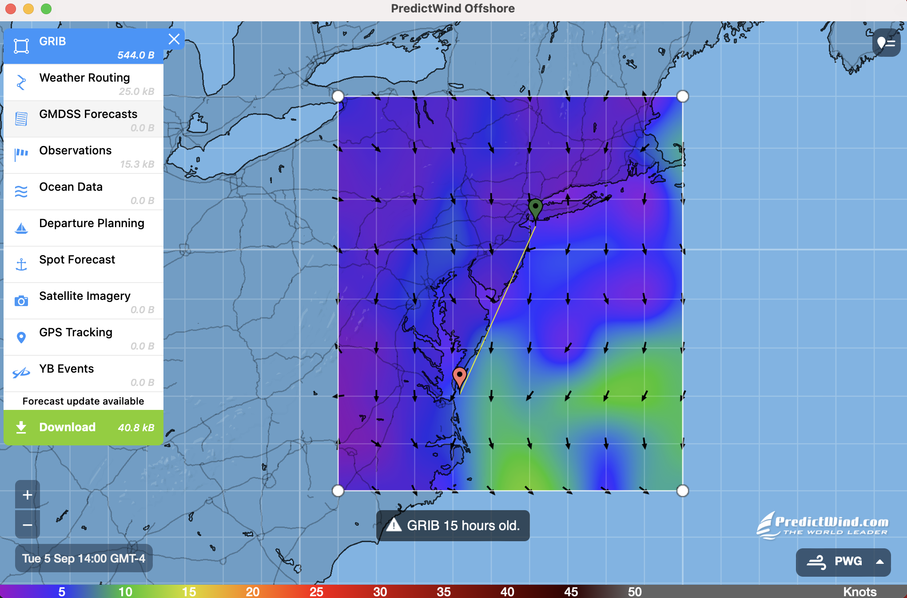

# Bermuda Race, Wind Data Analysis, Best Sailing Path, Dijkstra's Algorithm, 3rd Place

This project is for a yacht sailing competition to Bermuda.

The primary challenge in this endeavor lay in handling the vast volume of weather data originating from multiple sources, including PWS, ECMWF, GFS, SPIRE, and UKMO models. The sheer magnitude of data rendered manual analysis unfeasible. To address this issue, I developed **a Python program capable of automating the analysis of 20 weather data collection stations along our intended route.** This automated system effectively identified discrepancies between predictions and actual data on the day of the race. Over the course of a month, we collected data at 3-hour intervals daily, with the aim of uncovering recurring patterns and determining the most accurate models for predicting wind speed, gusts, wind direction, and temperature.

The most formidable challenge was integrating those most reliable weather forecasting models, tailored to specific wind characteristics, **to chart the shortest competitive route**. I applied the knowledge gained from my CPSC 223 & 365 classes at Yale to implement a bit more sophisticated Dijkstra's Algorithm. However, ensuring a continuous path while circumventing weather grid points introduced additional computational complexities, warranting further discussion.

Notwithstanding these challenges, the team's yacht achieved the third-place finish among five competing boats. This project underscored the crutial role of data analysis and algorithmic solutions in optimizing racing routes. For more details regarding our performance, please visit this link, and you can also find coverage in the Cape Gazette [Article](https://www.capegazette.com/article/new-jersey-crew-crosses-bay-win-lewes-cup/261257).
  

